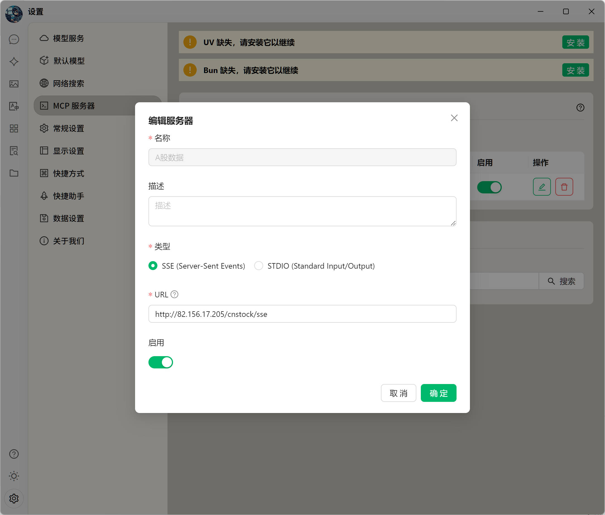
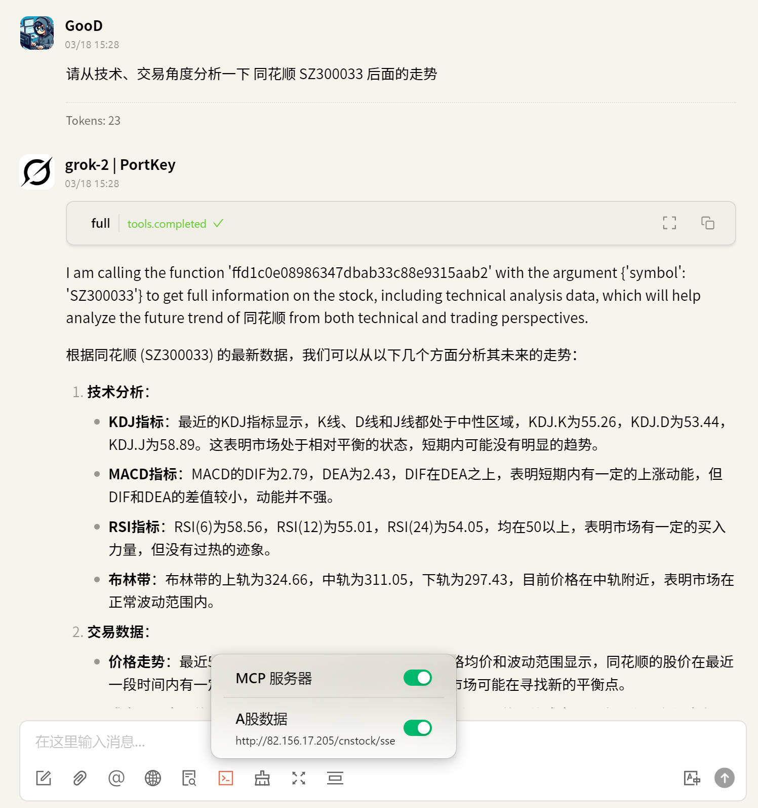

# 简介

这是一个为大模型提供 A 股数据的的 MCP(Model Content Protocol) 服务。

# MCP Tools

目前提供一下的若干工具：

- brief: 给定股票的基本信息，行情数据
- medium: 提供所有基本数据和一些财务数据
- full: 提供所有中等数据和技术指标

# 使用方法

由于股票的数据比较庞大，所以我们提供了一个公开的服务地址, 查看 [tests/test.sh](tests/test.sh) 文件，里面有一些测试用例以及相关的使用方法。

然后需要一个 MCP 客户端来连接这个服务，下面是一些常用的 MCP 客户端的配置方法。

## CherryStudio

[CherryStudio](https://github.com/CherryHQ/cherry-studio) 是一个支持 MCP 的客户端，提供了用户友好的界面和丰富的功能。

### 配置

配置路径为

> 左侧栏 -> 设置 -> MCP 设置 -> 添加服务器

在弹出的对话框中, 参考下图填入相关的信息

然后启用即可

### 使用

## DeepChat

[DeepChat](https://github.com/ThinkInAIXYZ/deepchat) 是一个支持 MCP 的客户端，提供了用户友好的界面和丰富的功能。

### 配置

配置路径为

> 左侧栏 -> 设置 -> MCP 服务器 -> 添加服务器

在弹出的对话框中, 参考下图填入相关的信息

然后启用即可

### 使用

