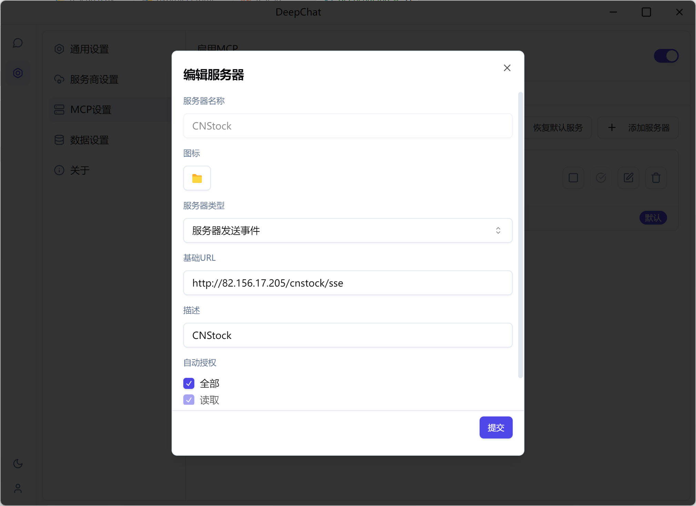
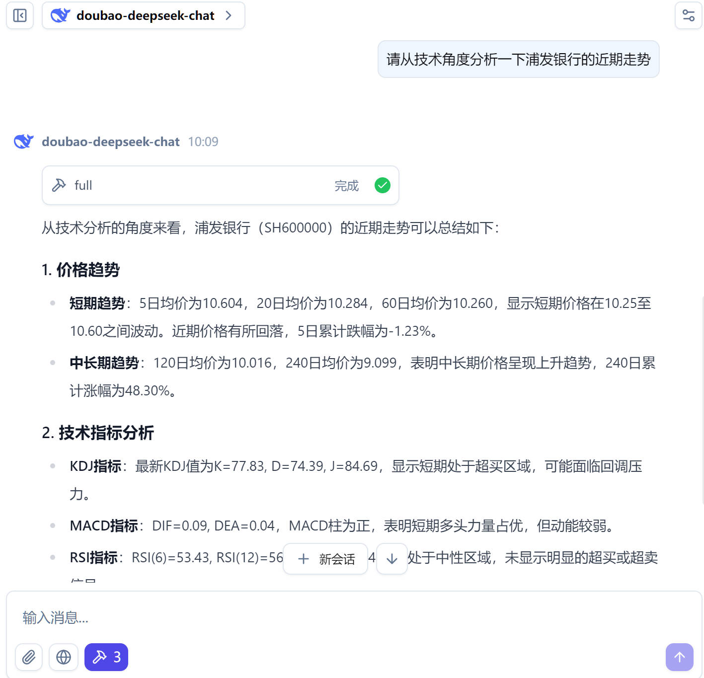

# 通过 MCP 让你的 DeepSeek 分析最新的股票走势

DeepSeek 具备强大的分析能力，但由于缺少最新的股票数据，它并不能为你提供最新的股票走势分析。为了让 DeepSeek 能够分析最新的股票走势，有必要将最新的股票数据提供给 DeepSeek。为此，有以下的一些方法：

- 手动的将最新的股票数据编辑在提词中，然后让 DeepSeek 进行分析。但这种方法非常麻烦，操作很繁琐。
- 让 DeepSeek 联网搜索最新的股票数据，然后进行分析。由于搜索引擎的滞后性，DeepSeek 可能无法获取最新的股票数据，同时是否能搜索到准确的股票数据也是一个问题。

现在，我们可以通过 MCP（Model Context Protocol）来实现这一目标，MCP 是一种让大模型与外部交互的协议，通过 MCP，我们可以将最新的股票数据提供给 DeepSeek，让 DeepSeek 能够分析最新的股票走势。

下面，以 [DeepChat](https://github.com/ThinkInAIXYZ/deepchat) 这个支持 MCP 的客户端为例，介绍如何使用 MCP 来让 DeepSeek 分析最新的股票走势。其他的支持 MCP 包括 [CherryStudio](https://github.com/CherryHQ/cherry-studio), [Claude Desktop](https://claude.ai/download) 等，使用方法类似。

在安装了 `DeepChat` 之后, 我们需要配置 MCP 服务器，配置路径为：

> 左侧栏 -> 设置 -> MCP 服务器 -> 添加服务器

MCP 目前有两种和 DeepSeek 交互的方式：

- stdio: 标准输入输出, 这种模式, 需要 MCP 服务运行在本地.
- sse: 服务器推送事件, 这种模式, MCP 服务运行在远程服务器上.

由于股票的数据比较庞大，在本地运行不太现实, 通过[mcp-cn-a-stock](https://github.com/elsejj/mcp-cn-a-stock) 这个开源项目, 我们可以使用一个现成的 MCP 服务，`http://82.156.17.205/cnstock/sse`. 这个服务提供了最新的 A 股数据.

参考以下的截图来配置 MCP 服务器：

配置完成后，启用它即可.

在启用 MCP 服务器后，当让 DeepSeek 分析股票走势时, 它会自动从 MCP 服务器获取最新的股票数据, 例如

这样, 我们就可以借助 DeepSeek 强大的分析能力来解读股票的走势.
